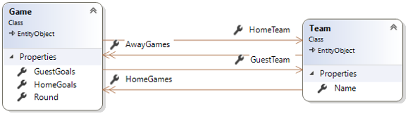
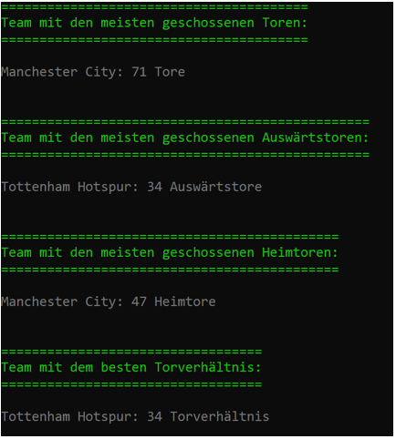
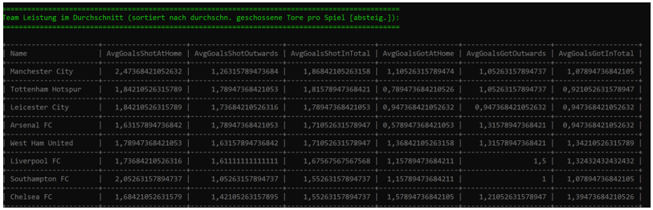
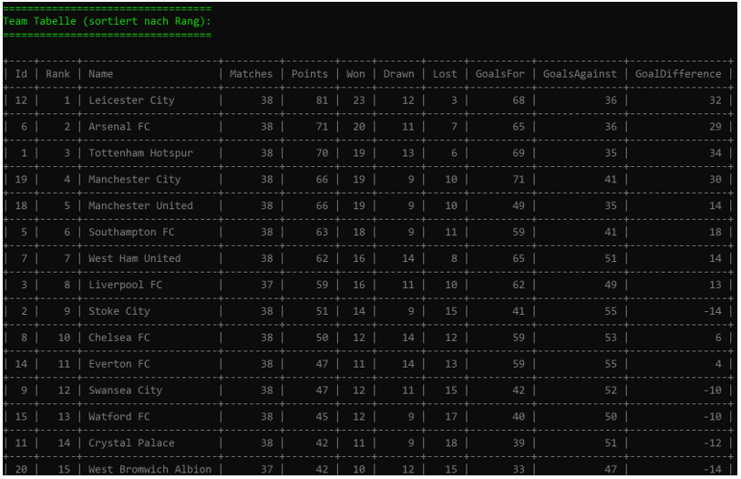

# Premier League

## Lehrziele

* Entity Framework Core
* Unit of Work / Repositories
* CSV-Dateien
* LINQ

Die Daten einer Saison der Premier League liegen als CSV-Datei vor. Sie sind im `ImportController` einzulesen und werden von der `ImportConsole` in die Datenbank geschrieben.

Ihre Aufgabe ist es, die Spielergebnisse anhand von LINQ-Abfragen zu analysieren. Für den Core-Layer und die Persistenzschicht ist der Rahmen bereits erstellt.

Der `ConnectionString` ist in den einzelnen Projekten bereits angelegt.

## Core

Die Entitätsklassen sind bereits angelegt. Auch die Annotationen zur Definition der Datenbank sind bereits implementiert.



Die Klasse `Game` verwaltet die Informationen zu einem Spiel in einer Runde und verwaltet die Tore der beiden beteiligten Teams. Ein `Team` verwaltet seine Spiele getrennt in Heimspiele und Auswärtsspiele.

Im Corelayer sind die Contracts für die Repositories bedarfsgerecht zu erweitern. Die leeren Interfaces sind bereits vorgegeben.

## Import

Es sind die 379 Spieldaten von 20 Teams aus der Datei `Premierleague.csv` zu importieren.

Sie können davon ausgehen, dass jedes Team zumindest einmal zu Hause gespielt hat!


## Persistence

Die Migration wurde bereits angelegt und muss nur verwendet werden, wenn an den Entitätsklassen Änderungen vorgenommen werden:

* Persistence als StartupProject 
* `Add-Migration InitialMigration`
* `UpdateDatabase` mit Kontrolle, ob DB angelegt wurde
* Die Daten über die `ImportConsole` importieren.

Die Repositories müssen noch um die benötigten Methoden erweitert werden.

## Analyse

Zusätzlich zum Import der Daten werden in der `ImportConsole` noch folgende Statistiken/Kennzahlen errechnet:

* Team mit den meisten geschossenen Toren
* Team mit den meisten geschossenen Auswärtstoren
* Team mit den meisten geschossenen Heimtoren
* Team mit dem besten Torverhältnis



* Tabelle der Teamleistung (Durchschnitt) – siehe Screenshot
   * Verwenden Sie zur Verwaltung einer Tabellenzeile ein DTO vom Typ `TeamStatisticDto`
   * Sortiert absteigend nach den durchschnitlich geschossenen Tore pro Spiel



* Teamtabelle – siehe Screenshot
   * Verwenden Sie zur Verwaltung einer Tabellenzeile ein DTO vom Typ TeamTableRowDto
   * Sortiert absteigend nach Punkten und Torverhältnis



## Hinweise

* Verwenden Sie für die formatierte Ausgabe die Hilfsmethode `PrintResult(..)`:

  ```csharp
  PrintResult(
    $"Team mit den meisten geschossenen Toren:",
    $"{teamWithMostGoals.Team.Name}: {teamWithMostGoals.Goals} Tore");
  ```

* Verwenden Sie zur Ausgabe von Tabellen in der Konsole die Klasse `ConsoleTable`:

  ```csharp
  ConsoleTable
    .From(teamAverage)
    .Configure(o => o.NumberAlignment = Alignment.Right)
    .ToStringAlternative()
  ```